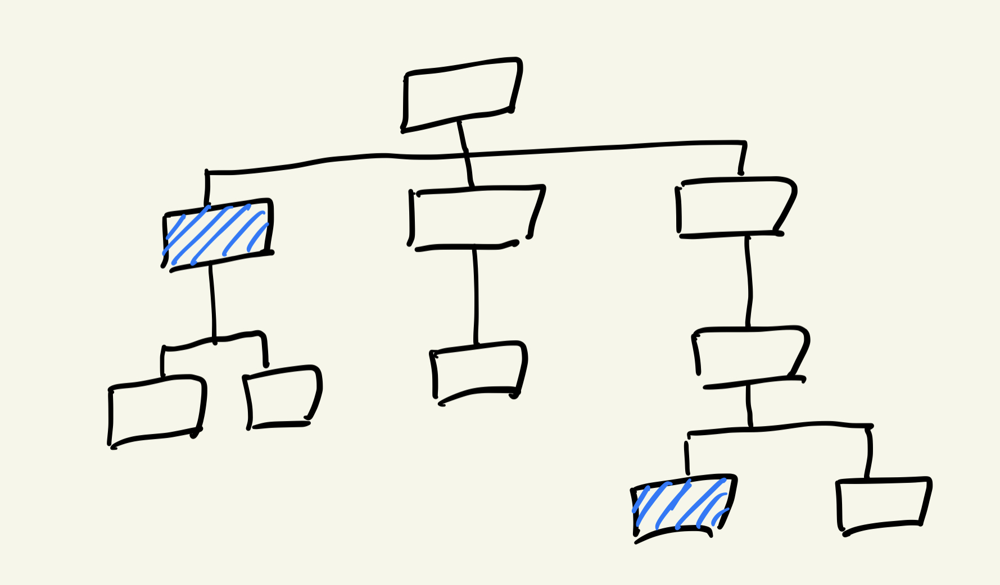
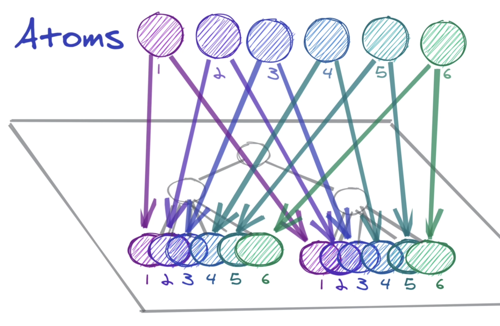

# 상태관리 라이브러리

## 리액트 상태관리의 불편한 점

리액트는 기본적으로 **단방향 데이터 흐름(one-way data flow)**을 가집니다. 다시 말해, 부모에서 자식 방향으로 props를 통해 데이터를 전달하는 것이 일반적입니다.&#x20;

이러한 특징은 리액트 서비스 개발을 직관적으로 만들어주었지만, **몇 가지 비효율** 또한 발생했습니다.&#x20;


### <mark style="background-color:yellow;">**자식 컴포넌트 → 부모 컴포넌트의 데이터 흐름이 필요한 경우**</mark>

리액트로 서비스를 만들다 보면 어쩔 수 없이 **자식 → 부모 방향**으로의 데이터 흐름이 발생하는 경우가 생깁니다.&#x20;

* 자식 컴포넌트에서 부모 컴포넌트의 state 값을 업데이트 해줘야 하는 경우
* 자식 -> 부모 방향으로 state를 끌어올려야 하는 경우 [(참고자료)](https://ko.reactjs.org/docs/lifting-state-up.html)

컴포넌트의 깊이 차이가 1-depth라면 괜찮을 것 같습니다. 하지만 규모가 커져서 두 컴포넌트 사이에 많은 컴포넌트가 생긴다면 어떨까요? 사실상 props 전달이 필요없는 중간 컴포넌트에게 데이터가 전달되게 됩니다.&#x20;

### <mark style="background-color:yellow;">**여러 컴포넌트에서 동일한 state값을 쓰고 싶은 경우**</mark>

Root가 다른 자식 컴포넌트들이 같은 state를 공유해야하는 경우, **최상위 부모(Root)에 state를 정의**해두고 **해당 state**를 자식 컴포넌트로 **각각 다 내려주어야 합니다.**  공유가 필요한 컴포넌트에만 state가 공유되면 되는 상황이므로 이 또한 비효율이 발생하겠죠?

<figure><figcaption></figcaption></figure>


이렇게 상태(state) 관리에서의 어려움을 해결하고자 나온 것들이 \
(전역) 상태관리 라이브러리(State Management Library)입니다.\
\
상태관리 라이브러리에는 Recoil, Redux, Mobx, Context API, Zustand 등이 있습니다.\
\
이 중 대표적인 상태관리 라이브러리인 **Recoil**에 대해 알아보겠습니다.&#x20;



## Recoil

<figure><figcaption></figcaption></figure>

### <mark style="background-color:yellow;">Recoil의 특징</mark>

_**Atom**_

global state마다 **atom**이라는 상태 단위를 생성하여 관리합니다.&#x20;

atom은 **업데이트**와 **구독**이 가능합니다. atom이 업데이트 되면, 해당 atom을 구독하고 있던 모든 컴포넌트들의 state가 새로운 값으로 리렌더링 됩니다. **동일한 atom을 여러 컴포넌트에서 구독**할 수 있습니다.&#x20;


```javascript
import { atom } from 'recoil';

const fontSizeState = atom({
  key: 'fontSizeState',
  default: 14,
});
```

* **atom의 key는 unique** 해야합니다. 일반적으로 atom을 할당한 변수와 동일한 이름으로 key 이름을 지어줍니다.&#x20;
* **default** 속성에는 **state의 초기값**을 넣어줍니다.&#x20;

_****_

_**Selector**_

Selector 는 상태를 기반으로 전달된 데이터를 **가공**할 때 사용됩니다. 또한, 주어진 종속성 값 집합에 대해 항상 동일한 값을 반환하는 부작용이 없는 "순수함수"입니다.&#x20;

최소한의 상태 집합만 atoms에 저장하고 다른 모든 파생되는 데이터는 selectors에 명시한 함수를 통해 효율적으로 계산함으로써 쓸모없는 상태의 보존을 방지합니다.&#x20;

* selector의 key 역시 unique 해야합니다.&#x20;

```javascript
import { selector } from 'recoil';
...

const fontSizeLabelState = selector({
  key: 'fontSizeLabelState',
  get: ({get}) => {
    const fontSize = get(fontSizeState);
    const unit = 'px';

    return `${fontSize}${unit}`;
  },
});
```
