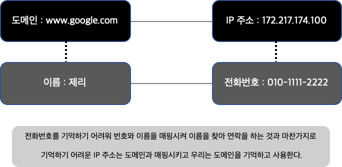

# Network 기초 개념

## 서버란 무엇인가

**Serve** + -er 제공하다

**무엇을 제공**하는 존재일까? **정보(Data)**

서버는 **홀알바**에 비유할 수 있습니다.

손님(Client)이 많을 때 홀알바가 필요해지듯이,

서버 또한 **클라이언트가 많을 때 필요**합니다.

### <mark style="background-color:yellow;">서버 개발자는 어떤 일을 하는지 전반적인 아키텍쳐를 통해 이해하기</mark>

<figure><figcaption></figcaption></figure>

<figure><figcaption></figcaption></figure>

### <mark style="background-color:yellow;">서버 개발자와 협업할 때, 클라이언트 개발자가 알아야할 것</mark>

* **주소** : IP 주소(223.130.200.107), Domain 주소([www.naver.com](http://www.naver.com))
* **메뉴판** : API 시트(명세서)
* **주문방법** : 프로토콜(Protocol) ⇒ **규칙, 규약**이라는 뜻!

<figure><figcaption></figcaption></figure>

****

****

