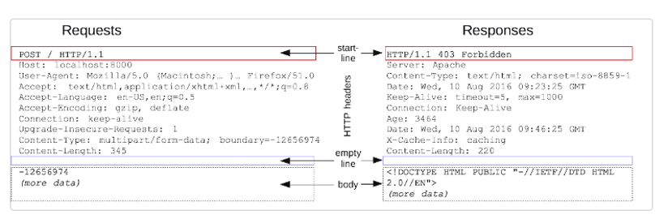

# Network 기초 개념

## 서버란 무엇인가

**Serve** + -er 제공하다

**무엇을 제공**하는 존재일까? **정보(Data)**

서버는 **홀알바**에 비유할 수 있습니다.

손님(Client)이 많을 때 홀알바가 필요해지듯이,

서버 또한 **클라이언트가 많을 때 필요**합니다.

### <mark style="background-color:yellow;">서버 개발자는 어떤 일을 하는지 전반적인 아키텍쳐를 통해 이해하기</mark>

<figure><figcaption></figcaption></figure>

<figure><figcaption></figcaption></figure>

### <mark style="background-color:yellow;">서버 개발자와 협업할 때, 클라이언트 개발자가 알아야할 것</mark>

* **주소** : IP 주소(223.130.200.107), Domain 주소([www.naver.com](http://www.naver.com))
* **메뉴판** : API 시트(명세서)
* **주문방법** : 프로토콜(Protocol) ⇒ **규칙, 규약**이라는 뜻!

<figure><figcaption></figcaption></figure>

****

#### <프로토콜>

컴퓨터와 컴퓨터 간 통신을 하려고 하는데, 서로의 요청과 응답을 이해할 수 없다면 어떨까요? 마치 처음 들어보는 언어를 사용하는 외국인과 대화하는 상황처럼, 원활한 통신이 어려워 원하는 작업을 처리하지 못할 것입니다. 서로 다른 언어를 사용하는 사람들끼리 소통을 원활하게 할 수 있도록 영어 등의 공용어를 사용하죠. 컴퓨터 간의 통신에도 일종의 공용어를 사용하는데 이것이 바로 프로토콜입니다.

원래 프로토콜은 국가 간 외교 의전 절차를 뜻하는 말인데요. 컴퓨터 네트워크에서의 프로토콜은 서로 다른 컴퓨터들끼리 원활하게 통신할 수 있도록 정해 놓은 규칙과 절차라고 생각하시면 됩니다.

#### \<TCP/IP>

TCP/IP로 알려진 인터넷 프로토콜 스위트(Internet Protocol Suite)는 인터넷에서 컴퓨터들이 서로 정보를 주고 받는데 쓰이는 프로토콜의 집합입니다. 인터넷을 사용한 데이터 통신은 대부분 TCP와 IP를 기반으로 이루어지기에 두 프로토콜을 따서 TCP/IP란 이름이 붙은 것이죠.

TCP/IP에서는 데이터를 패킷(Packet)이라고 하는 작은 단위로 나누어 전송합니다. IP(Internet Protocol)는 빠르게 특정 목적지 주소로 패킷을 전달하는 역할의 프로토콜입니다. 특정 목적지 주소는 앞서 배운 IP 주소가 되겠죠? IP는 빠르게 전송하는 것이 목적이기 때문에 패킷 전달 여부를 보증하지 않습니다. 또한 송신사자 패킷을 보낸 순서와 수신자가 패킷을 받는 순서가 다를 수 있습니다. 패킷이라는 작은 단위로 데이터를 나누어 전송하는데 순서가 뒤섞이거나 데이터가 유실될 수도 있으니 이는 큰 문제겠지요.

TCP(Transmission Control Protocol)는 이러한 문제를 해결해주는 신뢰성 있는 프로토콜입니다. TCP는 목적지에 도착한 패킷들을 순서에 맞게 정렬합니다. 또한 통신 과정 중 유실된 패킷이 있다면 송신자 측에 재요청을 합니다.   &#x20;

정리하자면, 우리는 TCP와 IP 두 가지 프로토콜을 함께 사용함으로써 빠르게 데이터를 전달하면서도 데이터 전송의 신뢰성을 보장할 수 있습니다.

#### \<HTTP>

HTTP(Hypertext Transfer Protocol)은 인터넷 상에서 클라이언트-서버간 데이터를 주고 받기 위해 사용되는 프로토콜입니다. 또한 HTTP는 앞서 살펴본 TCP/IP 프로토콜 집합의 구성요소 중 하나입니다.

HTTP는 요청-응답 프로토콜으로도 불립니다. 브라우저 주소창에 http://www.google.com 을 입력하여 구글 웹사이트로 접속하는 상황을 예로 들어봅시다. 해당 주소를 입력하면, 클라이언트인 브라우저는 구글 서버로 HTTP 요청을 하게 됩니다. 그리고 구글 서버는 브라우저에게 HTTP 응답으로 웹사이트를 띄우는데 필요한 리소스(HTML 문서 등)를 전달해줍니다. 참고로 웹에서 리소스는 어떠한 파일을 의미합니다.

HTTP 요청 및 응답 시 전달하는 메시지에는 다양한 정보들이 들어갑니다. HTTP 메시지의 구조는 크게 시작 줄(start-line), header, body로 나눌 수 있습니다. 시작 줄에는 요청 정보 혹은 요청 수행 성공 여부에 대한 정보가 들어갈 수 있습니다. header에는 요청 혹은 body에 대한 설명이 들어갑니다. 마지막으로 body에는 요청과 관련된 내용이 옵션으로 들어가거나(POST 요청 등) 응답 컨텐츠가 들어갑니다.

<figure><figcaption></figcaption></figure>

HTTP 요청 시작 줄에는 **HTTP 메서드, URI, HTTP 버전**이 들어갑니다.

HTTP 메서드(Method)는 서버가 수행해야할 동작을 나타냅니다. 메서드의 종류는 총 9가지가 있지만, 주로 사용되는 메서드는 총 5가지입니다.

\-       GET : 리소스 조회

\-       POST : 리소스 생성 및 등록

\-       PUT : 리소스 수정

\-       PATCH : 리소스 일부 수정

\-       DELETE : 리소스 삭제

URI(Uniform Resource Identifier)는 특정 리소스를 식별하는 통합 자원 식별자입니다. 말은 어렵지만 우리에게 친숙한 http://www.google.com과 같은 형태가 바로 URI입니다.

scheme:\[//\[user\[:password]@]host\[:port]]\[/path]\[?query]\[#fragment]

\-       scheme : 사용할 프로토콜 종류(http, https 등)

\-       user와 password : 서버 데이터에 접근하기 위해 필요한 사용자의 이름과 비밀번호. 필요없을 경우 생략 가능.

\-       host와 port : 접근할 서버의 호스트명(도메인, IP 주소 등)과 포트번호

\-       path : 접근할 서버의 경로에 대한 상세 정보

\-       query : 접근할 대상에 전달하는 추가적인 정보

\-       fragment : 메인 리소스 내에 존재하는 서브 리소스에 접근할 때 이를 식별하기 위한 정보

마지막으로 HTTP 버전에는 HTTP/1.0, HTTP/1.1, HTTP/2, HTTP/3이 있으며 기존의 문제점을 해결하기 위해 더 높은 버전의 HTTP가 등장했습니다.
